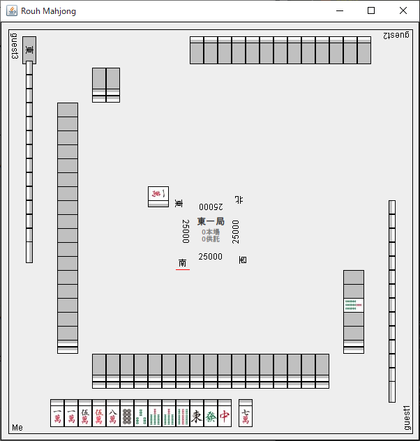

# rouh-mahjong-net
デスクトップ麻雀アプリケーション

[ダウンロード](https://github.com/rouhjp/rouh-mahjong-net/releases/latest)

1～4人での通信対戦が可能。

対戦を主催し、他プレイヤーを参加させるにはポートの解放が必要です。

ファイアウォール設定での通信許可、ルータでのポートフォワーディング設定を行ってください。

また、ローカルでのテストプレイも可能です。(メニューからテストゲームを選択する)

#### 麻雀牌画像

麻雀牌の画像は以下からお借りしています。

 - 豆腐麻雀 https://majandofu.com/mahjong-images
